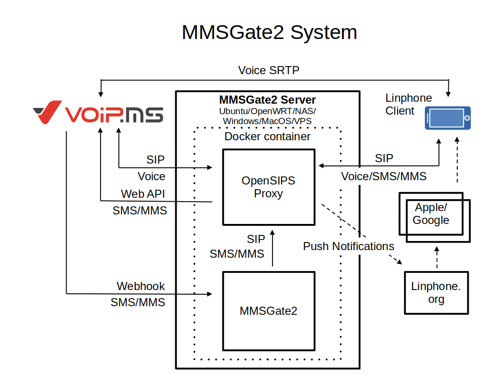
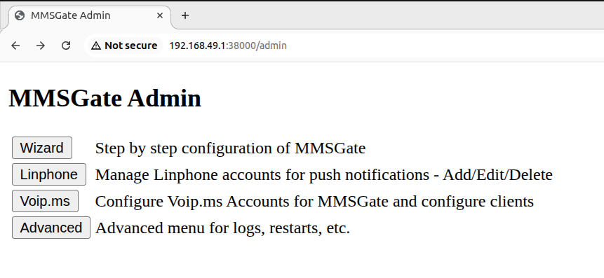
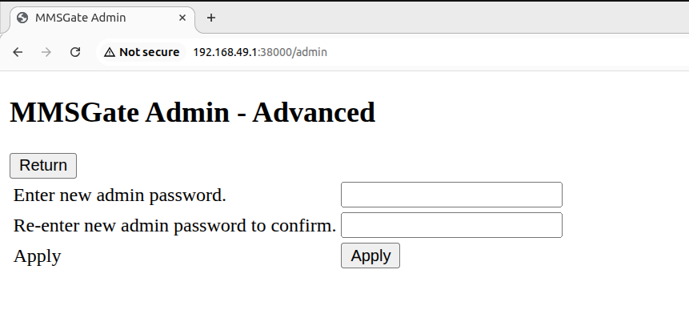
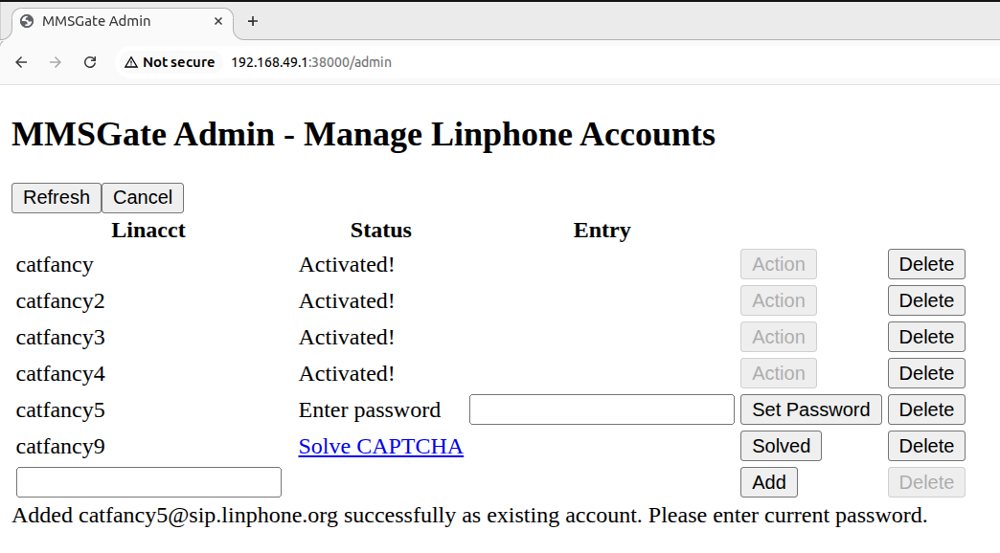
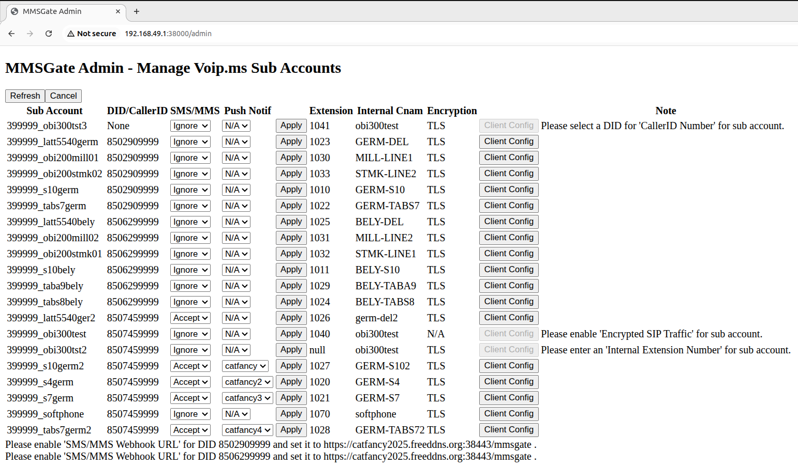
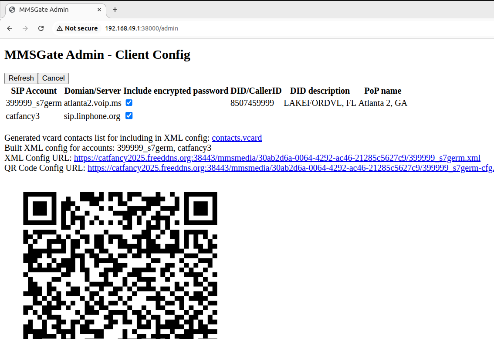

# MMSGate2

## Table of Contents

- [MMSGate2](#mmsgate2)
  - [Table of Contents](#table-of-contents)
  - [Introduction](#introduction)
  - [Requirements and Prerequisites](#requirements-and-prerequisites)
  - [Prepare the Host](#prepare-the-host)
  - [Install MMSGate2](#install-mmsgate2)
    - [Docker Image](#docker-image)
    - [Docker Container](#docker-container)
    - [Backups](#backups)
  - [Configure MMSGate2](#configure-mmsgate2)
    - [Connect](#connect)
    - [Password Change](#password-change)
    - [Wizard](#wizard)
    - [Linphone Accounts](#linphone-accounts)
    - [VoIP.ms Sub Accounts](#voipms-sub-accounts)
    - [Client Config](#client-config)
  - [FAQ](#faq)

## Introduction

MMSGate2 is a MMS message gateway between [VoIP.ms](https://voip.ms/) and [Linphone](https://www.linphone.org/en/) clients.Linphone is an open-source soft-phone. It makes VoIP SIP calls and can send/receive SMS/MMS messages over the SIP protocol. It can also use push notifications to ensure no calls are missed and SMS/MMS are delivered quickly.

VoIP.ms provides voice and SMS over SIP protocol. While MMS messages are possible, the service is provided over a customized API and web hook. MMSGate2 provides the link between VoIP.ms's MMS service and Linphone clients.

The Linphone clients connect through [OpenSIPS](https://www.opensips.org/) to VoIP.ms via SIP protocols. MMSgate2 communicates via SIP and web interfaces with VoIP.ms and Linphone clients.  Calls are established via the standard SIP protocol.  However, the voice data is sent directly between VoIP.ms and the Linphone clients.  Optional Push Notifications are sent via standard SIP messages, utilizing the existing Linphone infrastructure.   

MMSGate2 relies on VoIP.ms sub accounts and their extensions.  When clients are configured, it includes contacts for the extensions.  Messages and calls between extensions are free of charge.  All communications are encrypted.  Messages between extensions are passed directly from client to client via MMSGate2.  



## Requirements and Prerequisites

MMSGate2 has a very small footprint, as little as 100 megabytes of memory.  This allows it to run on residential routers with [OpenWRT](https://openwrt.org/) installed or a very low cost VPS servers.  It can also run on a pocket sized hobby computer like a [Raspberry Pi Zero W](https://www.raspberrypi.com/products/raspberry-pi-zero-w/).  As long as the system can run [Docker](https://www.docker.com/); Docker Community Edition (CE) or Docker-Desktop; it can run MMSGate2.  That includes Raspberry Pi devices and laptops or desktops running Windows, Ubuntu or even MacOS.  Many NAS devices that you may already own can also run Docker.  

If you can download and install software, type URLs into a web page, copy-and-paste text, you can install Docker and MMSGate2.

## Prepare the Host

The host is the device you will install Docker.  MMSGate2 will run within Docker.  The host preparation will be different for different hosts.  Let's look at each one:

<details details name='host'>
<summary>Windows</summary>
For any Windows system, start by downloading Docker-Desktop for Windows 
from <a href='https://www.docker.com/' target='_blank'>https://www.docker.com/</a>.  You
will most likely want the AMD64 version.  <br><br>
Once installed, open the Docker-Desktop application.  Confirm that it 
says "Engine Started" in the lower left.  It may take a little while.  If 
it does not appear, you may have to reboot and try again.  <br><br>
Once the engine is started, click on the ">_ Terminal" prompt in the 
lower-right of Docker Desktop.  A terminal window will appear.  This is 
where you will be pasting commands.  <br><br>
Tip: Closing the Docker Desktop window does not stop the Docker engine.  
If you wish to stop Docker completely, use the taskbar in the lower-right 
of the Windows desktop.  Right-click on Docker Desktop and select 
Quit Docker Desktop.  
</details>

<details details name='host'>
<summary>Apple MacOS</summary>
For any MacOS system, start by downloading Docker-Desktop for Mac from
<a href='https://www.docker.com/' target='_blank'>https://www.docker.com/</a>.  You
likely know if you need the Intel or Sillicon version.  If not, try 
one.  It it won't install, try the other. <br><br>
Once installed, open the Docker-Desktop application.  Confirm that it 
says "Engine Started" in the lower left.  It may take a little while.  <br><br>
Once the engine is started, click on the ">_ Terminal" prompt in the 
lower-right of Docker Desktop.  A terminal window will appear.  This is 
where you will be pasting commands.  <br><br>
Tip: Closing the Docker Desktop window does not stop the Docker engine.  
If you wish to stop Docker completely, You can open the Activity Monitor, 
select Docker, and then use the Quit button.  
</details>

<details details name='host'>
<summary>Ubuntu Desktop</summary>
For most any Linux GUI desktop system, start by selecting Download 
Docker-Desktop, Download for Linux from 
<a href='https://www.docker.com/' target='_blank'>https://www.docker.com/</a>.  It will 
take you to the steps needed for your distribution.<br><br>
Once installed, open the Docker-Desktop application.  Confirm that it 
says "Engine Started" in the lower left.  It may take a little while.  <br><br>
Once the engine is started, click on the ">_ Terminal" prompt in the 
lower-right of Docker Desktop.  A terminal window will appear.  This is 
where you will be pasting commands.  <br><br>
Tip: Closing the Docker Desktop window does not stop the Docker engine.  
If you wish to stop Docker completely, You can open the Activity Monitor, 
click Docker, and then select Quit Docker Desktop.  
</details>

<details details name='host'>
<summary>OpenWRT</summary>
<a href='https://openwrt.org/' target='_blank'>OpenWRT</a> runs a wide variety of hardware.  
If it has enough memory, i.e. 100m free; also ARM32 (v7+) or 
ARM64 processor or an AMD64 (Intel x86); plus some storage; you can 
install Docker.  <br><br>
First, make sure you have storage.  Don't try to run Docker on your 
internal flash storage.  Read 
<a href='https://openwrt.org/docs/guide-user/storage/usb-drives' target='_blank'>Using 
storage devices</a> to get started.  Then setup the
<a href='https://openwrt.org/docs/guide-user/additional-software/extroot_configuration' target='_blank'>
Extroot configuration</a>.  On that same page, there is a section on swap.  
It is recommended to also perform the swap steps.  <br><br>
To install Docker, open a SSH session and paste these commands:
<pre><code>opkg update
opkg install docker
opkg install luci-app-dockerman
</code></pre>
The default network for docker has some issues, so we'll create a new one:
<pre><code>uci show network
uci set network.docker1='device'
uci set network.docker1.type='bridge'
uci set network.docker1.name='docker1'
uci set network.dockerlan='interface'
uci set network.dockerlan.proto='none'
uci set network.dockerlan.device='docker1'
uci set network.dockerlan.auto='0'
uci commit network
/etc/init.d/network reload
# tell docker about the new network
docker network create -o com.docker.network.bridge.enable_icc=true -o com.docker.network.bridge.enable_ip_masquerade=true \
  dockerlan -o com.docker.network.bridge.host_binding_ipv4=0.0.0.0 -o com.docker.network.bridge.name=docker1 \
  --ip-range=172.19.0.0/16 --subnet 172.19.0.0/16 --gateway=172.19.0.1
</code></pre>
Next, we need some firewall settings:
<pre><code>uci show firewall
# create a zone for docker
uci set firewall.docker=zone
uci set firewall.docker.name='docker'
uci set firewall.docker.input='ACCEPT'
uci set firewall.docker.output='ACCEPT'
uci set firewall.docker.forward='ACCEPT'
uci set firewall.docker.network='docker'
uci add_list firewall.docker.network='dockerlan'
uci set firewall.docker.device='docker0'
uci add_list firewall.docker.device='docker1'
# docker can talk to all and lan to docker, but wan can't talk to docker
uci set firewall.docker2lan.src='docker'
uci set firewall.docker2lan.dest='lan'
uci set firewall.lan2docker=forwarding
uci set firewall.lan2docker.src='lan'
uci set firewall.lan2docker.dest='docker'
uci set firewall.docker2wan=forwarding
uci set firewall.docker2wan.src='docker'
uci set firewall.docker2wan.dest='wan'
# open ports for mmsgate2
uci set firewall.mmsgate2=rule
uci set firewall.mmsgate2.src='wan'
uci set firewall.mmsgate2.name='mmsgate2'
uci set firewall.mmsgate2.dest_port='5061 38443'
uci set firewall.mmsgate2.target='ACCEPT'
uci set firewall.mmsgate2.dest='*'
# good to be paranoid
uci set firewall.mmsgate2noadm=rule
uci set firewall.mmsgate2noadm.src='wan'
uci set firewall.mmsgate2noadm.name='mmsgate2noadm'
uci set firewall.mmsgate2noadm.target='REJECT'
uci set firewall.mmsgate2noadm.dest_port='38000'
uci set firewall.mmsgate2noadm.dest='*'
uci commit firewall
/etc/init.d/firewall reload
</code></pre>
</details>

<details details name='host'>
<summary>Raspberry Pi/VPS/Ubuntu Server</summary>
For all these devices, you'll need Ubuntu Server installed.  Once 
on the system, you can follow the guide 
<a href='https://docs.docker.com/engine/install/ubuntu' target='_blank'>Docker 
install Ubuntu</a>.  <br><br>
Tip for the Raspberry Pi:  These devices don't need many accessories.  
It is often successful with just flashing Ubuntu Server onto the SD card 
with SSH enabled and network setup (including Wifi).  Once the SD card 
is in the Pi, power it up and a few minutes later, check the DHCP server 
in the router to get the Pi's IP address.  Just SSH to it.  
Thus, no keyboard or monitor needed.  <br><br>
Tip for VPS: The admin interface is not available except via a 
private network such as 192.168.0.0/16 or 10.0.0.0/8.  Naturally, A VPS 
may not have a private network. However, it is available locally within 
the container via port 38080.  Use the following command to open a web 
browser locally:
<pre><code>docker exec -it mmsgate2 lynx http://127.0.0.1:38080/admin
</code></pre>
</details>

<details details name='host'>
<summary>NAS</summary>
NAS devices that are ARM or AMD (Intel) based have applications that you 
can install that run Docker; apps like 
<a href='https://www.qnap.com/en-us/software/container-station' target='_blank'>
QNAP's Container Station</a> or 
<a href='https://www.synology.com/en-br/dsm/feature/docker' target='_blank'>
Synology's Container Manager</a>.  <br><br>
The command prompt will still be needed, so once the app is install, 
enable SSH and open a SSH comand prompt.<br><br>
Synology tip: Commands pasted into the SSH sessions will usually need a
"<code>sudo</code>" prefix.  This is because the default user via SSH may not have docker 
permission.  <br><br>
QNAP tip: To make sure MMSGate2 starts when the NAS starts and has 
correct resource limits, open "Container Station", open "mmsgate2", 
stop then open "Settings" and enable "Auto start" and set resource limits.
</details>

**The host and up-time:**  For the long term, It is not recommended to run MMSGate2 on a system that has active power-management (can go to sleep) or is also used for web browsing, email and office documents.  For the long term, please use a host that will be up and operational 24/7.  

## Install MMSGate2

Now that the host is all set, we can install MMSGate2.

### Docker Image

Open the Docker Command Line Interface (CLI).  For Docker-Desktop, that is the ">_ Terminal" in the lower right of Docker-Desktop.  For OpenWRT, NAS and Ubuntu Servers, that is the SSH session.  

Copy-and-paste the following command into the Docker CLI:

```bash
docker pull rvgo4it/mmsgate2
```

You will see multiple download and extracts for the image layers.  It may take a few minutes.  Once done, we can run MMSGate2.  

### Docker Container

For the following command, make note of some options you may want to change.  For example, to give MMSGate2 more memory, adjust the "-m 100m" to "-m 200m" for 200 megs of memory as an example.  You can adjust the "--cpus 2" option to use more CPU cores.  However, more cores means more processes and more processes need more memory.  Also note the "TZ=America/New_York" value.  Depending on your time zone, you may want to change it to "TZ=America/Chicago", "TZ=America/Los_Angeles" or "TZ=America/Denver".  

For Windows, use this command:

```PowerShell
docker run -m 100m --name mmsgate2 -d `
  -p 5061:5061 -p 38443:38443 -p 38000:38000 `
  --cpus 2 `
  -e "TZ=America/New_York" `
  -v datavol:/data `
  -v confvol:/etc/opensips `
  rvgo4it/mmsgate2 
```

For OpenWRT, use this command:

```bash
docker run -m 100m --name mmsgate2 -d \
  -p 5061:5061 -p 38443:38443 -p 38000:38000 \
  --cpus 2 --network dockerlan \
  -e "TZ=America/New_York" \
  -v datavol:/data \
  -v confvol:/etc/opensips \
  rvgo4it/mmsgate2
```

For MacOS, NAS and Ubuntu server and desktop, use this command:

```bash
docker run -m 100m --name mmsgate2 -d \
  -p 5061:5061 -p 38443:38443 -p 38000:38000 \
  --cpus 2 \
  -e "TZ=America/New_York" \
  -v datavol:/data \
  -v confvol:/etc/opensips \
  rvgo4it/mmsgate2
```

Set the container to always restart:

```bash
docker update --restart unless-stopped mmsgate2
```

### Backups

Use these commands to see where the MMSGate2 data and configuration is stored.  Make note of the "Mountpoint".

```bash
docker inspect confvol
docker inspect datavol
```

Make sure that the backup system used on the host includes these paths.

## Configure MMSGate2

MMSGate2 is now running, but it needs to be configured for you.

### Connect

Open your favorite web browser and connect using http to the host's IP, port 38000 and path /admin.  For Docker-Desktop users, you can use 127.0.0.1 for the local host.  Thus, the URL will be:

`http://127.0.0.1:38000/admin`

For others, use the IP address you used for SSH.  It may be something like:

`http://192.168.99.99:38000/admin`

It will prompt for an ID and password:  

| prompt    | default |
| --------- | ------- |
| Username: | admin   |
| Password: | Apple99 |

It will look something like this:



### Password Change

**IMPORTANT:** Change the admin password right away.  It is under Advanced->Set_Admin_Password.  



Enter the password twice and click Apply.  

Once done, return to the main menu.

### Wizard

Click Wizard. The Wizard will walk you through the setup of MMSGate2 one step at a time.  The Wizard will help you with these items:

- [ ] Disable and stop OpenSIPS.

- [ ] Reserve the host's IP address in the router so it won't change.

- [ ] Open the network ports required for MMSGate2 via the router.

- [ ] Test the network ports.

- [ ] Setup a Dynamic Domain Name System (DDNS).

- [ ] Create an encryption certificate.

- [ ] Setup VoIP.ms API access.

- [ ] OpenSIPS is enabled and container restarted.

For OpenWRT hosts, no router configuration needed.  Those steps in the Wizard can be skipped.  Once the Wizard is completed, you will return to the main menu.

### Linphone Accounts

If you want to use Push Notifications, click Linphone.



You can create new Linphone accounts from this page or add existing one.  Once they are created or added successfully, they will appear as "Activated!" and can be used for Push Notifications.  

You will need one Linphone account for each mobile device running the Linphone App and Push Notification is needed.  When done, click Cancel to return to the main menu.

### VoIP.ms Sub Accounts

From the main menu, select VoIP.ms.  



This page displays all your sub accounts.  It will not make any changes to VoIP.ms.  

It may ask you to make changes to your sub accounts or DIDs if needed.  MMSGate needs a DID selected as the CallerID for any sub accounts.  Also, the sub account needs to be configured for encrypted SIP traffic and be assigned a unique extension.  Any DID used with MMSGate2 also needs to have a web hook URL entered.  This page will tell you if needed.  After making changes to sub accounts or DIDs at the Voip.ms web site, click Refresh to load the new settings.   

The SMS/MMS Ignore/Accept is for when a message arrives for one of your DIDs.  It can be accepted and forwarded to any sub accounts associated with that DID.  Or, the message can be ignored.  An ATA device, SIP phone or other devices that cannot receive SMS and MMS messages, always set to ignore.  

Under Push Notif, a Linphone account can be selected for the sub account.  If selected, Push Notifications can be used by to wake the mobile app.  If the same Linphone account is assigned to multiple sub accounts, it tells MMSGate that all those sub accounts will be used on the same mobile app.  

When modifying Push Notif or SMS/MMS settings for a sub account, press Apply after making selection.  

Once done settings preferences, click "Client Config".

### Client Config



By default, the client config includes an encrypted copy of the sub account password.  If using Push Notification, the config will include all sub accounts assigned the same Linphone account.  If not using Push Notification, additional sub accounts can be selected.  If the password preference is changed or a sub account added, press Refresh.  If the encrypted password is not included, the client will prompt for a password.  

The QR code is the easiest way to configure the client.  Install a Linphone client.

- Android - [Linphone - Apps on Google Play](https://play.google.com/store/apps/details?id=org.linphone&pli=1)

- Android - [Linphone - F-Droid - Free and Open Source Android App Repository](https://f-droid.org/packages/org.linphone/)
  
  - Note: Linphone installed from F-Droid cannot use Push Notification

- Apple iOS - [‎Linphone App - App Store](https://apps.apple.com/us/app/linphone/id360065638)

- Apple MacOS - [Download](https://linphone.org/releases/macosx/latest_app)

- Windows - [Download](https://linphone.org/releases/windows/latest_app_win64)

- Linux - [Download](https://linphone.org/releases/linux/latest_app)

Once the client is installed, open it and respond to the usual prompts.  Stop short of registering or providing any credentials.  When offered, use the camera to scan the QR code.   Once scanned, logon is done and you are online.  

Some clients cannot scan a QR code.  For them, you will need to copy-and-paste the XML Config URL into the client.  

If Push Notification was configured, the system will send a free SMS message via the selected Linphone account when needed.  When the first message appears, simply mute the conversation.  There is no need for a pop-up for every Push Notification.  

If Push Notification was NOT configured, be sure to adjust your mobile device's power management settings so as to keep the app alive so that you can receive calls and messages.

## FAQ

- VoIP.ms already has an app for iOS and Android.  Why use MMSGate2?
  
  - The VoIP.ms Softphone cannot do MMS.  Thus, MMSGate2 is still needed. In addition, it cannot send messages to other extensions.  Extension messaging is very useful and 100% free!  

- What happens if you attach a non-media file, for example a PDF, to a MMS message?  
  
  - If it is sent to an extension, Linphone will accept it as an MMS message and allow the receiver to open and view the file.  This is a handy method for transferring files between devices like phones or tablets.  
  
  - If it is sent to a cellular mobile number, it will be converted into a SMS message containing the URL for downloading the file.  

- I have a cable modem and home Wifi router.  Configure both?
  
  - If the cable modem is purely a modem, it will provide an Internet IP address to your home Wifi router.  So, just the home router needs to be configured.   
  - However, some cable modems also act as a router.  This is called a double NAT,  and can complicate things.  It can still be done by configuring both.  But it would be better to simplify things.  

- The contacts that are imported during client config, where do they come from? 
  
  - All the sub accounts that have an extension will be imported as contacts.  The name is from the optional description fields on the sub account.  If it's blank, the contact will use the internal CNAM for the sub account.  If it is also blank, it will default to just the extension as the name.  The extension in the contact will include the "10" prefix to the number.  

- Why does MMSGate2 use so little memory?
  
  - It is mostly due to OpenSIPS.  OpenSIPS is very memory efficient.  Much more so than Flexisip that was used in the older MMSGate.  Also, OpenSIPS has lots of features and functions that it took over from the Python scripts and PJSIP.  Python and PJSIP used lots of resources in the old MMSGate.  In the new MMSGate2, the Python scripts are still the biggest memory hogs.  
  
  - Currently, the Python scripts primary function is for the web hook from VoIP.ms for receiving SMS/MMS messages and also uploading files from the mobile app for new MMS messages.  The admin interface is secondary.  

- What happens if MMSGate2 exceeds the 100m of memory?
  
  - If that happens, Docker will kill MMSGate2 processes.  Depending on the process, different things will happen.  [Gunicorn](https://gunicorn.org/) monitors the Python processes and will restart any killed.  But some are more critical and will cause the entire Python script to exit and restart.  For OpenSIPS, a killed process may also cause the application to exit and restart.  If process 1 is killed, the entire container will restart.

- New image version for MMSGate2 released?  How to install?
  
  - To install a new MMSGate2 image, clear out the old container with these commands:  
  - ```bash
    docker stop mmsgate2
    docker container rm mmsgate2
    ```
  - Jump to the [Docker Image](#docker-image) and [Docker Container](#docker-container) sections and perform just those commands again.  The config and data volumes will be retained.  

- How much data?
  
  - The size of the data stored by MMSGate2 is determined by the size and number of files in your MMS messages.  However, after 90 days, the files will be removed.  

- How can I change the 90 day limit?
  
  - From the command prompt, type:
  
  - ```bash
    docker exec -it mmsgate2 sudo crontab -e
    ```
  
  - Look for a "find"" command and adjust the -mtime parameter.    

- I may have missed some messages.  MMSGate2 was down for hours earlier today.  How can I recover them?
  
  - If MMSGate2 is offline when a SMS or MMS message is sent to one of your DIDs, the web hook call from VoIP.ms to MMSGate2 will fail.  
  
  - However, the message is still in the logs at VoIP.ms.  The mmsreconcile.py script runs daily at 2:35 AM.  It will compare the message logs at VoIP.ms to the local logs.  Any messages missed will be resent.  It will check for messages as old as 7 days.  

- Why does the Linphone app show two accounts connected?
  
  - When the client was configured, a Linphone account was selected so as to use Push Notifications (PN).  
  
  - PN requires credentials shared between the sending server, Linphone.org and the Linphone app.  MMSGate2 triggers the PN by sending a free SMS message via the Linphone.org server to the Linphone account registered in the app.  

- I forgot my password.  How do I reset it?
  
  - From the command prompt, i.e. SSH or ">_ Terminal", paste the following command:
  
  - ```bash
    docker exec -it mmsgate2 lynx http://127.0.0.1:38080/admin
    ```
  
  - The admin page will appear in text format.  Select Advanced->Set_Admin_Password.  
